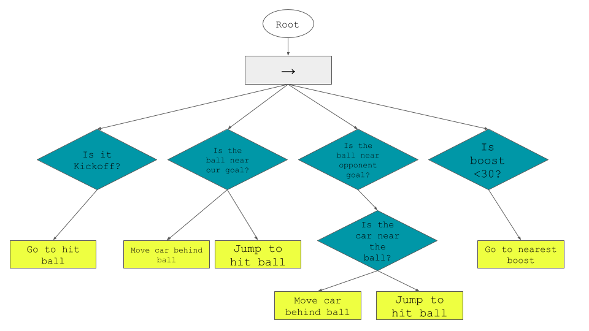

# RocketLeagueAIBot
This project is for the University of Notre Dame Course: Game-Based AI Bots

Document your control mechanism, high-level strategy, and implemented functionality. (5 Points)
This is your chance to highlight what makes your bot unique, why someone may want to use it/expand upon it, etc.

Provide the list of required dependencies for both your chosen game and your bot. (5 Points)
### Dependencies
These are the dependencies that will be installed when the Rocket League Bot Gui is first run. They are:

- backports
- certifi
- chardet
- colorama
- configparser.py
- crayons
- dataclasses.py
- flatbuffers
- idna
- inputs.py
- numpy
- psutil
- py4j
- PyQt5
- requests
- rlbot
- rlbot_gui
- RLUtilities
- selenium
- urllib3
- webdriver_manager
- websockets

`make install`
`setup.bat`

These commands will download the RLBot GUI and install all of the above dependencies.

Note: The GUI requires Windows and an existing copy of Rocket League.

Run the .exe file and drag the bot named "Carstiano Revnaldbot" to either of the team fields.
Other team members or opponents are not required, but can be added by also dragging the bots to the respective teams.
By clicking "Start", the GUI will start a game in Rocket League with the bot(s).
The game continues until time runs out or "Stop" is clicked in the GUI.

